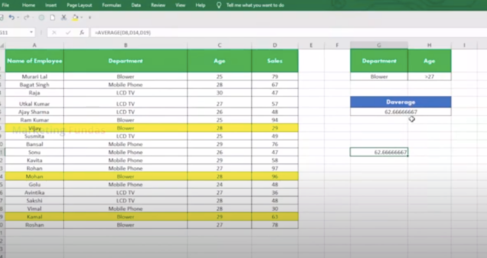

# MS Excel

https://www.youtube.com/watch?v=OX-iyb-21tk -  rishab

#class1 - Microsoft Excel Full Course Hindi | Introduction to MS Excel | MS Excel Full Course Marketing Fundas

https://www.youtube.com/watch?v=16fZZXexZuE&list=PLXwTOG3-tRwgy4lJ9j_CPwpJmr2uCaGH1&index=1

# class2 - What is Rows and Columns in MS Excel | Basics of Microsoft Excel for Beginners | #msexcelcourse

https://www.youtube.com/watch?v=dt8g0uAy0cE&list=PLXwTOG3-tRwgy4lJ9j_CPwpJmr2uCaGH1

top most tool or header in excel is called reban

1. to resize cell - alt + v and then Z
2. ctrl + right arrow (>) to go to last right column of the sheet  - 16384 columns
3. ctrl + bottom arrow  to go to last bottom row of the sheet  - 1048576 rows
3. ctrl + up arrow  to go to first  row of the sheet  - 1048576 rows

column name -C4,B2,A5 etc

formula =40+50 = 90

range of column - C3:E6

shift + f11 - for new sheet

# class3 - MS Excel Basic Formulas Full Tutorial in Hindi | Most Important Formulas in Excel | #msexcelcourse

https://www.youtube.com/watch?v=dyl91P37P1Y&list=PLXwTOG3-tRwgy4lJ9j_CPwpJmr2uCaGH1&index=3

formula ex. C3 = 30, B3 = 20, 

sum ->    =B3 + C3 = 50
subtract -> =B3 - C3 = -10
multiply -> =B3 * C3 = 600
divide -> =B3 / C3 = 1.5
SQRT(16) -> =SQRT(16) = 4
POWER(10,2) -> =POWER(10,2) = 100

# class 4 - How to Insert Rows and Columns in MS Excel | Basics of MS Excel for Beginners Hindi #msexcelcourse

https://www.youtube.com/watch?v=Qb5AqDIlkog&list=PLXwTOG3-tRwgy4lJ9j_CPwpJmr2uCaGH1

# class 5 - Learn MS Excel Data Entry Basics | How to Data Entry Work in Excel for Beginners | #msexcelcourse

https://www.youtube.com/watch?v=z-1BJw6iebg&list=PLXwTOG3-tRwgy4lJ9j_CPwpJmr2uCaGH1

Alt + H + O + I - alg alg press krna h to resize column width

Ctrl + drag mouse to get incremental number in column like - 1,2,3,4,5,...

# class 6 - How to Apply Formula in Tabular Format in Excel | Tabular Format in Excel | MS Excel Course in Hindi

https://www.youtube.com/watch?v=xZa8XWty_4o&list=PLXwTOG3-tRwgy4lJ9j_CPwpJmr2uCaGH1

for sum - 1. Alt + =
          2. inbuit function SUM -> =SUM(C1:E1)
          3. =SUM(C1+D1+E1+F1)

for max -  =MAX(C1:E1)
for min -  =MIN(C1:E1)
for COUNT -  =COUNT(C1:E1)
for AVG -  =AVG(C1:E1)
for % -  =F1/500*100

# class 7 - What is Conditional Formatting in Excel in Hindi | How To Do Conditional Formatting in Excel

https://www.youtube.com/watch?v=XWztQ4YeULw&list=PLXwTOG3-tRwgy4lJ9j_CPwpJmr2uCaGH1

Conditional Formatting formula for showing condition based on results

# class 8 - How to use IF, AND, OR Functions in Excel (हिंदी में) | MS Excel IF Function | IF Formula in Excel

https://www.youtube.com/watch?v=DD7W8L2c8xA&list=PLXwTOG3-tRwgy4lJ9j_CPwpJmr2uCaGH1

IF 
IF AND
IF OR
IF IF

formula 
IF ->        =IF(F3>=33,"PASS","FAIL")
IF AND ->    =IF(AND(C2>=33,D2>=33,E2>=33,F2>=33,G2>=33),"PASS","FAIL")
IF OR  ->    =IF(OR(C2<33,D2<33,E2<33,F2<33,G2<33),"FAIL","PASS")
IF IF  ->    =IF(N2="FAIL","F",IF(M2>=60,"A+",IF(M2>=50,"A",IF(M2>=40,"B",IF(M2>=33,"C")))))

# class 9 - How to Convert Excel Spreadsheet Data Into a Table | Excel Data into Table Form | MS Excel Course

https://www.youtube.com/watch?v=GjJc99lWcvM&list=PLXwTOG3-tRwgy4lJ9j_CPwpJmr2uCaGH1

for Excel Data into Table Form -> Home -> Format as table

to remove table from existiong table format - Table Design -> Covert to range -> Clear -> clear format

# class 10 - How To Use Sort and Filter Functions in MS Excel | Sort Function Excel | Filter Function in Excel

https://www.youtube.com/watch?v=MczRtqZRYKk&list=PLXwTOG3-tRwgy4lJ9j_CPwpJmr2uCaGH1

for filter - Alt + A + T  or (sort & filter) or Data -> sort and filter
Sort - Asc or desc beside filter 

# class 11 - How to Make a Chart and Graph in Excel | MS Excel Chart and Graphs Step by Step Tutorial | #msexcel

https://www.youtube.com/watch?v=ix3ZZV5b4Dw&list=PLXwTOG3-tRwgy4lJ9j_CPwpJmr2uCaGH1

go to insert and then charts

# class 12 - How to Use Home Tab All Features in MS Excel step by step in Hindi | Home Tab in Excel | #msexcel

https://www.youtube.com/watch?v=LesxHk4XM4U&list=PLXwTOG3-tRwgy4lJ9j_CPwpJmr2uCaGH1

format printer - write something on cell and click and then click on format printer

Home tools

# class 13 - How to Print Excel Sheet on One Page | How to Print Out Large Excel Sheet in A4 Paper | #excelcourse

https://www.youtube.com/watch?v=okeKsmU953o&list=PLXwTOG3-tRwgy4lJ9j_CPwpJmr2uCaGH1

Page layout and then file and then print and then print

# class 14- How to Add Bullet Points in Excel | How to Insert Bullet in Excel in Hindi | MS Excel Course

https://www.youtube.com/watch?v=BN80Ubge8Pw&list=PLXwTOG3-tRwgy4lJ9j_CPwpJmr2uCaGH1

Home - format -format cell - custom - general hata kr ALT + 7
insert -> symbol -> verdana latin extended additional
=char(149) 

=CHAR(149)&" "&B1  (for infront of name or list for bullet point)

copy from docx

# class 15 - How to Add and Create Borders in Excel | MS Excel Course for Beginners in Hindi | #msexcelcourse

https://www.youtube.com/watch?v=yABXkHapf-g&list=PLXwTOG3-tRwgy4lJ9j_CPwpJmr2uCaGH1

Home -> box of borders and line

# class 16 - How To Group and Ungroup Rows and Columns in Excel | Group and Ungroup in Excel | #excelcourse

https://www.youtube.com/watch?v=-vodb3PXLXk&list=PLXwTOG3-tRwgy4lJ9j_CPwpJmr2uCaGH1

Data -> group 

# class 17 - How To Insert Watermark In MS Excel | Excel Logo Transparent Background | MS Excel Course in Hindi

https://www.youtube.com/watch?v=kKDWZlEuEws&list=PLXwTOG3-tRwgy4lJ9j_CPwpJmr2uCaGH1

insert - > text - header and footer -> picture and select picture and then header - set hiegiht - water mark

# class 18 - How To Use Quick Access Toolbar in Excel | How To Customize Quick Access Toolbar in Excel | #excel

https://www.youtube.com/watch?v=QLE8OGkydMQ&list=PLXwTOG3-tRwgy4lJ9j_CPwpJmr2uCaGH1

Home - customized tool bar

# class 19- How To Hide and Unhide Columns and Rows in Excel | How To Select and Fill Blank Cells in Excel

https://www.youtube.com/watch?v=SJxzZK0MgAI&list=PLXwTOG3-tRwgy4lJ9j_CPwpJmr2uCaGH1

for multiple row - ctrl + select row

to unhide  -selcect all rows-   home - format - hide and unhide

ctrl + G and special and then blank for empty cells

# class - 20 - What is Paste Special and How to use this Option in MS Excel Full Guide | MS Excel Course in Hindi

https://www.youtube.com/watch?v=CJ3T07WZzhA&list=PLXwTOG3-tRwgy4lJ9j_CPwpJmr2uCaGH1

home - pasting technic - 15 types

picture format

# class - 21 - How to use Header & Footer, Status Bar, Number Format, Change Case in MS Excel | #msexcelcourse

https://www.youtube.com/watch?v=azqL-gTVOgY&list=PLXwTOG3-tRwgy4lJ9j_CPwpJmr2uCaGH1

customized bar at bottom

number , currency , accounting, date , time , percentage - home - general 

=upper(A1)

=lower(A1)

=upper("Ajay")

# class - 22 - How To Protect Your Excel Workbook | How To Protect Excel File With Password | #msexcelcourse

https://www.youtube.com/watch?v=99eXfQImOyc&list=PLXwTOG3-tRwgy4lJ9j_CPwpJmr2uCaGH1

Review - Manage protection - password (sheet)
for workbook protect - review - prtect workbook

for protect cell - home -  number and then lock and then review then protect

save as then select tool and enter password while saving

# class - 23 - How to use Format Painter in Excel | MS Excel Format Painter Shortcut | #msexcelcourse

https://www.youtube.com/watch?v=ctWfvypTs9Q&list=PLXwTOG3-tRwgy4lJ9j_CPwpJmr2uCaGH1

format printer for design same again and again

# class - 24 - How To Use Hyperlinks in Excel | How To Create a Hyperlink in Excel | Excel Hyperlink Tutorial

https://www.youtube.com/watch?v=Q1B9i5ecTeg&list=PLXwTOG3-tRwgy4lJ9j_CPwpJmr2uCaGH1

insert -> link
hyperlink 1 - file on same system or on web
hyperlink 2 -  web url
hyperlink 3 - place in tis document
hyperlink 4- create new document
hyperlink 5- email address

# class - 25 - How To Do Spell Check In Excel | Spelling Autocorrect In Excel | Comments Function In Excel

https://www.youtube.com/watch?v=NwdbVoRhwHY&list=PLXwTOG3-tRwgy4lJ9j_CPwpJmr2uCaGH1

Review -> ABC spelling

comment - review comment , right click on mouse

# class - 26 - Array Function in MS Excel | How To Use Array Formula in Excel | #arrayfunction #msexcelcourse

https://www.youtube.com/watch?v=zfmHHvIRmg0&list=PLXwTOG3-tRwgy4lJ9j_CPwpJmr2uCaGH1

for sum 

=SUM(B2:B4*C2:C4) -> (selct both column)

# class - 27 - Using the Excel Average and Average IF Functions | Excel Average Formula Explained in Hindi

https://www.youtube.com/watch?v=Lsgl-ssF5Gc&list=PLXwTOG3-tRwgy4lJ9j_CPwpJmr2uCaGH1

for average - =AVERAGE(A2:E2)

for averageif - =AVERAGEIF(A2:A8,A4,C2:C8) -> class,5th, marks of all rows

for averageifs - =AVERAGEIFS(avg_range,criteria_range1,criteria1,criteria_range2,criteria2) 
                 =AVERAGEIFS(C2:C8,A2:A8,A2,B2:B8,B4)

# class - 28 - How to use DAVERAGE Formula in Excel | Microsoft Excel DAVERAGE Function | MS Excel Course in Hindi

https://www.youtube.com/watch?v=J3e9eJzYAK4&list=PLXwTOG3-tRwgy4lJ9j_CPwpJmr2uCaGH1

average of blower sales whoes age is greater then 27

# class - 29 - DGET Formula in Excel in Hindi | DGET Full Form Excel | MS Excel DGET Function | #msexcelcourse

https://www.youtube.com/watch?v=Wxq9UD63Fyw&list=PLXwTOG3-tRwgy4lJ9j_CPwpJmr2uCaGH1

=DGET(databae,field,criteria)

# class - 30 - MAX, MIN, D MAX, D MIN Formulas in Excel | Excel MAX MIN Formula | MS Excel Course Marketing Fundas

https://www.youtube.com/watch?v=v7nbwI23JdM&list=PLXwTOG3-tRwgy4lJ9j_CPwpJmr2uCaGH1

=MAX(A2:E2)
=MIN(A2:E2)

=DMAX(database,field,criteria)
=DMIN(database,field,criteria)

# class - 31 - Date Formula in Excel and Date Functions in Excel | TODAY, EDATE and NOW Formulas in MS Excel

https://www.youtube.com/watch?v=Aye8NoNtKuQ&list=PLXwTOG3-tRwgy4lJ9j_CPwpJmr2uCaGH1

Today -> =today()
5 days after Today -> =today()+5
5 days before Today -> =today()-5

Edate  - date after 3 month or 5month

=edate(starting_date,month) for (+,-)

=edate(A2,B2)

Now -> =NOW()

ctrl + shift + semi column

# class - 32 - How to use COUNT, COUNTA, COUNTBLANK, COUNTIF, COUNTIFS, DCOUNT Formulas in MS Excel #msexcelcourse

https://www.youtube.com/watch?v=Ypse-RQ7VUU&list=PLXwTOG3-tRwgy4lJ9j_CPwpJmr2uCaGH1

=COUNT(A2:E2)

=COUNT(A1:O1)

to count blank cell ->  =COUNTBLANK(A2:E6)

count P or A -> =COUNTIF(A2:E2,"P") - count presrent

count boys % if > 60 -> =COUNTIFS(C4:C12,C4,N4:N12,">60")

Dcount(database,field,criteria)

DCOUNT(A2:E8,D2,G7:H8)

# class - 33 - MS Excel Formulas Reminder, Even, Odd | Microsoft Excel Course For Beginners in Hindi | #msexcel

https://www.youtube.com/watch?v=hsAgaUnAWhc&list=PLXwTOG3-tRwgy4lJ9j_CPwpJmr2uCaGH1

Reminder -> =MOD(A2,B2)

odd or evven -> =IF(C2=0,"EVEN","ODD") 

for odd or even -> =IF(ISODD(C2),"ROOM 7","ROOM 8")
for odd or even -> =IF(ISEVEN(C2),"ROOM 7","ROOM 8")

# class - 34 - MS Excel Functions Round, Round Down, Factorial and Discount Explained in Hindi | #msexcelcourse

https://www.youtube.com/watch?v=Lwm3mdybLUY&list=PLXwTOG3-tRwgy4lJ9j_CPwpJmr2uCaGH1

Round -> =ROUND(A2,2) - 4.564 to 4.56
Roundup -> =ROUNDUP(A2,2) - increase 4.564 to 4.57
Rounddown -> =ROUNDDOWN(A2,2) - decrease 4.564 to 4.56

Factorial -> =FACT(A2)

discount -> =A2*10%   or   =A2*(10/100) 
net price -> =E2-D2

# class - 35 - MS Excel Formulas INTEGER, ROMAN NO, TRIM, ABSOLUTE, CONCATENATE | #msexcelcourse

https://www.youtube.com/watch?v=WqzXMkRk49c&list=PLXwTOG3-tRwgy4lJ9j_CPwpJmr2uCaGH1

interger-> =INT(A2)

Roman number -> =ROMAN(A2)

Trim -> =TRIM(A2)

Absolute -> =ABS(A2) or =ABS((A2-B2))

Concatenate -> =CONCATENATE(A2,B2,C2)
Concatenate -> =CONCATENATE(A2,"",B2,"",C2)

# class - 36 - How To Calculate Simple and Compound Interest in MS Excel | #msexcelcompletecourse #hiteshgupta

https://www.youtube.com/watch?v=TQ1SoeRQvBs&list=PLXwTOG3-tRwgy4lJ9j_CPwpJmr2uCaGH1

Simple interest - (principal amount * Rate * Time(year)) / 100

Simple interest - =(A2*B2*C2)/100

if rate is in like 10% -> =(A2*B2*C2)

if time is in month  and rate is in like 10% -> =(A2*B2*C2)/12

Compount Interest - (PV(1+R/100)^N) - PV - Principal value(PV), Rate(R), Time (N)

CI -> =(B8(1+R/100)^B9)-B8

# class - 37 - The Excel FORECAST Function | How to Calculate Depreciation in MS Excel | #msexcelcompletecourse

https://www.youtube.com/watch?v=0G8khdPV3Pk&list=PLXwTOG3-tRwgy4lJ9j_CPwpJmr2uCaGH1

Forecast -> =FORECAST(C8,D2:D8,C2:C7)
deperecation DB fromula -> =DB(cost,scrape value, life, period)

# class - 38 - How to use Pivot Tables and Charts in Excel | Pivot Table Excel in Hindi | Pivot Chart Excel

https://www.youtube.com/watch?v=pknsV4MAzEM&list=PLXwTOG3-tRwgy4lJ9j_CPwpJmr2uCaGH1

insert - Pivot table - New worksheet -

Pivot chart analysis

# class - 39 - What is Data Validation Excel | Data Validation in Excel in Hindi | #msexcelcourse #datavalidation

https://www.youtube.com/watch?v=Ya27W6qn_OU&list=PLXwTOG3-tRwgy4lJ9j_CPwpJmr2uCaGH1

Data - validation - List, Age validation,text length, date of joining between

=istext(c2) - for text

# class - 40 - MS Excel Important Settings | Best Tips and Tricks in Excel | Microsoft Excel Course in Hindi

https://www.youtube.com/watch?v=HSZ6m0Zp5Qs&list=PLXwTOG3-tRwgy4lJ9j_CPwpJmr2uCaGH1

File - options - Advanced 