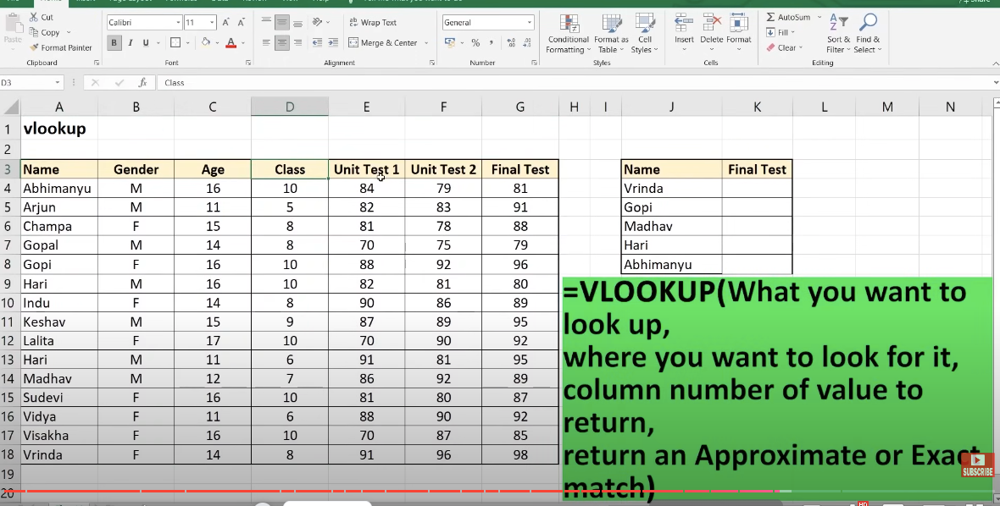

Excel Tutorial For Beginners in Hindi | Complete Microsoft Excel Tutorial (Basic To Advance)

https://www.youtube.com/watch?v=OX-iyb-21tk&list=PPSV

for joining two column
=CONCATENATE(A2,B2)

for max salary -

sort or filter or 

home-> conditional mandatory -> color

for duplicate values

home -> condtional formatting -> duplicate values

Remove duplicate - 

select all data and then go to data -> data tool -> remove duplicate -> select all -> ok

ctrl + y for adding row's

Merge and center - Home -> alignment -> Merge and Center

# Rounding of number

Home -> number -> rounding off

=ROUND(A2,num_digit) - 1.5560  = 5.0000,  1.0300 = 1.0000

=ROUND(A2,0) 

=ROUNDUP(A2,num_digit) - 1.0300 = 2.0000,  1.4500 = 2.0000 (Increase one number)

=ROUNDDOWN(A2,num_digit) - 1.0300 = 1.0000,  1.7500 = 1.0000 (Decrease one number)

# Autofill

January  - drag and it will give month name
Mon - Mon,Tue, Wed .....

# Add or edit comments

right click mouse - add or edit commnet

# Table & filters

ctrl + shift + L

filter on multiple column - data -> filter -> colum1 -asc and then add label colum2 - desc

marks between two number from filter

ctrl + T , or select data and go to insert tab and table

# Slicers 

for table -> go to insert -> filter -> slicer -> select columns and then from there you can see slicer and then select slicer you will get filtered data

# Insert pictures & shape

insert -> picture or shape and customize accoringly

shape format -> backword and forward 

# Insert Hyperlink

insert -> link -> select document -> add link on Name column add colum to show in different sheet  and select sheet name and ok 

ctrl + k -> web link also can be given

# create dropdownlist

create table1 with Grade column and one another table2 with Name and Grade column and then select columns from Grade column from table2 and then data -> data validation and then select list and then source select cell from Grade column

# split text 

ajay@gmail.com

split table columns data  select row- data -> split text to column then custom @ then enter 

# Insert Chart 

insert -> chart -> column type

# VLOOKUP FUNCTION & PIVOT TABLE

=VLOOKUP(coulumn_Name,table_array,index_of_column_vlookup,appropriate or exact (0 or 1))      - press fn + f4 for fix table (doller format)

=VLOOKUP(R5,$B$1:$P$7,8,0)

to remove any formula click all records and right click and paste options paste as value

# when and how to use pivot table

pivot table is a powerful data summarization tool in excel

calculate , summarize , analyse  by doing this we can find trend , pattern, compare

who score more boys or girls in final test?

insert -> pivot table

alway remmember if we are calculating vlaues then put in values place

for check count,avg,sum,min,max we can click on value errow

sort - when click on value asc-desc

for layout - design -> layoyut -> report layout -> show in tabular format

do not show sub total - design -> layoyut -> subtotal -> remove subtotal
do not show grand total - design -> layoyut -> grand total -> remove grand total

whatever change you have done in file it wont refelect in pivot table unless you didnot refresh
pivot table anayse ->data-> referesh -> referesh all

if you have added a column in file then you have to - pivot table anayse -> data -> change data source

